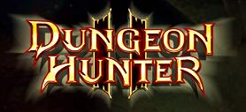

<p align="center"></p>

# Dungeon Hunter 2 — PS Vita Port

A native port of Gameloft's **Dungeon Hunter 2** (Android) to the PlayStation Vita, built on
[TheFloW's so-loader](https://github.com/TheOfficialFloW) technique: the original Android
`.so` libraries are relocated and run directly on the Vita, with a from-scratch
[FalsoJNI](https://github.com/v-atamanenko/FalsoJNI)-based bridge standing in for the parts of
the Android runtime the game calls into (rendering surface, touch input, asset loading, audio),
rendering through [vitaGL](https://github.com/Rinnegatamante/vitaGL) built from source.

**This repo is loader/bridge source code only.** It does not contain, and will never contain,
Gameloft's copyrighted game assets, APK, or `.so` binaries — see [Getting the game data](#getting-the-game-data)
below for what you need to supply yourself.

## Status: playable end-to-end, with known bugs — help wanted

The game boots, renders, and is playable start to finish on real hardware — menu, character
select, dungeon combat, saves/options that persist across reboots, physical-button controls
(movement, attack, skills, potion, pause and character menus) — but it is **not polished** and
has a few open issues that could use more eyes, more test hardware, and fresh ideas:

1. **Low combat frame rate.** ~20-25 FPS sustained in gameplay (up from an initial 5-6), ~60 FPS
   in menus and light scenes. The bottleneck is understood but not fully fixed: the engine's real
   frustum culling has to stay bypassed (it's what fixes the invisible-enemy bug below), so the
   entire level is animated/updated every frame regardless of the camera. See `PORTING_PLAN.md`
   Phase 23 for the full measurement trail.
2. **Repeating HUD icon column** — a column of duplicate badge/skill icons appears stacked under
   the character portrait. Root cause not yet found; several native and ActionScript-level
   hypotheses have been ruled out with real evidence (see `PORTING_PLAN.md`).
3. **Some enemies render invisible** — a health bar/nameplate and aggro ring appear, but no monster
   model is drawn. The opacity hypothesis has been ruled out with hard evidence; the current lead
   is a stale bounding box in the engine's own culling gate, found via full disassembly but not yet
   tested on hardware.

None of these block booting or playing the game — they're rough edges, not showstoppers. If you can
build for Vita, have a physical console to test on, or just want to dig into an interesting
reverse-engineering puzzle, **`PORTING_PLAN.md` is the full paper trail**: every hypothesis tried,
what was ruled out and how, and exactly what diagnostic hooks are already wired up and waiting for a
fresh hardware log. Issues and PRs are welcome.

## Controls

| Input | Action |
|---|---|
| Left stick / D-Pad | Move |
| Cross | Primary attack |
| Square | Skill 1 |
| Triangle | Skill 2 |
| Circle | Skill 3 |
| R1 | Health potion |
| START | Pause / in-game menu (toggle) |
| SELECT | Character screen (toggle) |
| L + R | Toggle bottom HUD controls' opacity between 1% (default) and 100%, for touch |
| Touch | Everything above, plus anything else the HUD exposes |

The action buttons call directly into the engine's own command API (same calls its Flash HUD
buttons make) rather than synthesizing touch events, after synthetic touch turned out to have a
hard ceiling — see `PORTING_PLAN.md` for why.

## Building

Requirements:
- [VitaSDK](https://vitasdk.org/) (`arm-vita-eabi-gcc`/`g++`), with `kubridge` installed via `vdpm`.
  `vitaGL` is vendored in this repo (built from source, not the prebuilt `vdpm` package) — see
  `README VITAGL.md`.
- Sony's `libshacccg.suprx` (shader compiler), obtained separately and placed in the repo root —
  this is Sony's own binary and is not redistributed here.
- `libshacccg.suprx` and the `kubridge.skprx` taiHEN plugin both need to be installed on the target
  Vita/Vita3K under `ur0:`/`ux0:tai` before first run.

```bash
./build.sh
```

`build.sh` rsyncs the project to a space-free temp directory (VitaSDK's toolchain doesn't handle
paths with spaces well), configures with CMake, and copies the resulting `.vpk`/`eboot.bin` back into
`build/`. It will prompt for a Debug (verbose logging, `DEBUG_SOLOADER`) or Release build. See its
header comment for build-flag variants, including `--hack-safe` (recommended: vitaGL's CPU-only
speedhacks) and `--culling-test [MODE]` (experimental frustum-culling levels).

`porting_tools/manage_vita.py` handles installing to a real Vita or Vita3K over FTP, pulling logs,
and downloading/symbolizing crash dumps — see `porting_tools/README.md`.

## Getting the game data

You need to legally own **Dungeon Hunter 2 HD** for Android to play this port. This repo does not
include the APK, its extracted contents, or any decompiled output — `.gitignore` excludes all of it
by design (see `PORTING_PLAN.md` §3). To build a playable install:

1. Obtain the APK from your own legally purchased copy.
2. Decompile it (`porting_tools/build/decompile_all.sh` wraps `jadx` + a Ghidra/angr container) if
   you need to cross-reference the original code — not required just to play.
3. Stage the game's asset files as loose files under `ux0:data/dungeon-hunter-2/` on the Vita (see
   `PORTING_PLAN.md` Phase 8 for the exact layout FalsoJNI's asset bridge expects).

## Credits

- [SoLoBoP](https://github.com/v-atamanenko) (Andy Nguyen, Rinnegatamante, Volodymyr Atamanenko) —
  the so-loader boilerplate this project is built on, MIT licensed (see `LICENSE`).
- [FalsoJNI](https://github.com/v-atamanenko/FalsoJNI) — the JNI bridge implementation.
- [vitaGL](https://github.com/Rinnegatamante/vitaGL) — the GLES driver, built from source.
- **Asphalt-5-Vita** — the closest comparable port (same soloader/FalsoJNI/vitaGL-from-source,
  Gameloft engine); its own performance write-up pointed directly at several of the CPU-side fixes
  that took this port from 5-6 FPS to ~20-25.
- Dungeon Hunter 2 is © Gameloft. This project is an unofficial, non-commercial fan port and is not
  affiliated with or endorsed by Gameloft.

## License

The loader/bridge source code in this repository is MIT licensed — see `LICENSE`. This license
covers this project's own code only, not Dungeon Hunter 2 itself.
